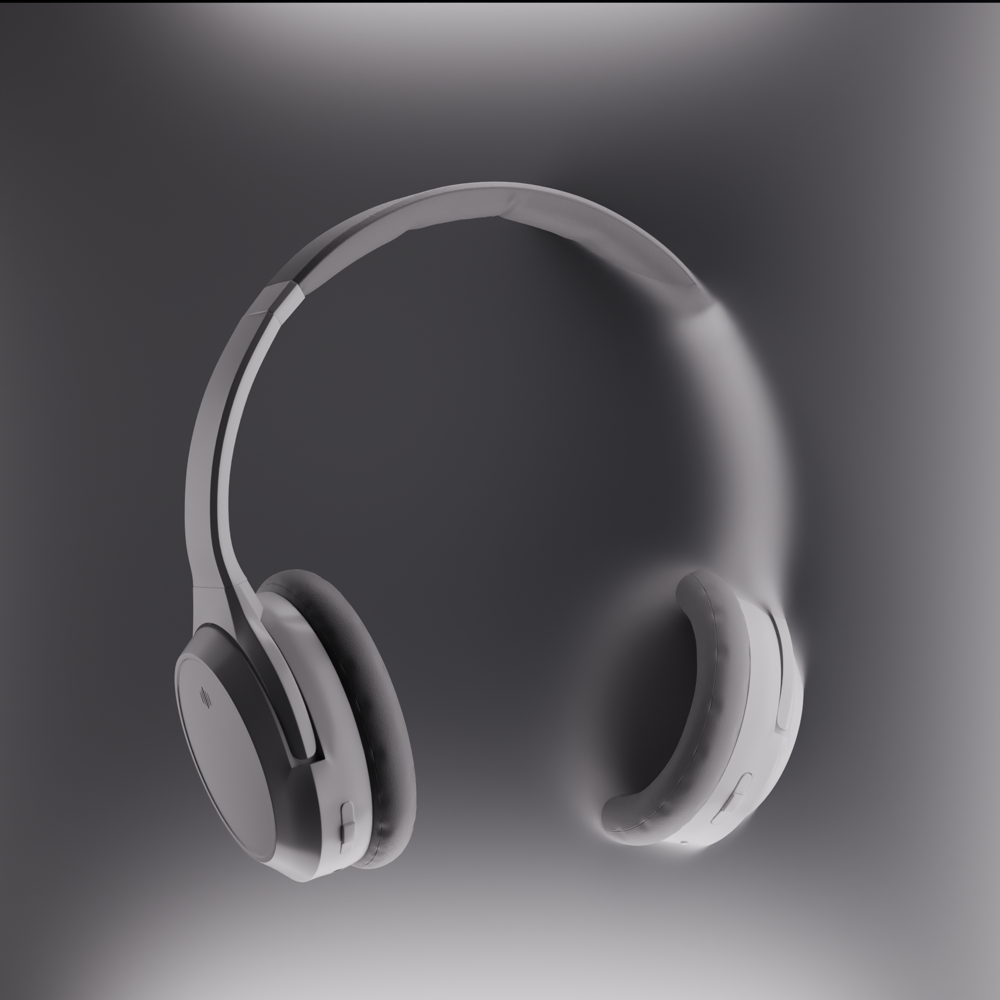

# Blender Portfolio

3D work exploring product visualization, environment lighting, and animation in Blender.
Still learning — this repo tracks progress over time rather than a "finished" collection.

## Projects

### MacBook Reveal (Animation)
Macro camera move revealing a laptop screen and backlit keyboard.

- **Focus:** camera animation, glass/metal shading, screen emission
- **Tools:** Blender ([Eevee / Cycles — pick one]), [render time if notable]
- [Full writeup →](macbook-reveal/README.md)

### Aviator Sunglasses
Studio product shot with a geometric podium set and colored shadows.

- **Focus:** glass/dielectric materials, studio lighting, composition
- **Tools:** Blender ([Eevee / Cycles])
- [Full writeup →](sunglasses/README.md)

### Wireless Headphones
Product still plus a clay-render turntable showing the modeling-to-shading process.

- **Focus:** hard-surface modeling, ambient occlusion, depth-of-field animation
- **Tools:** Blender ([Eevee / Cycles])
- [Full writeup →](headphones/README.md)

### Classroom Interior
Atmospheric environment render with morning light through the windows.

- **Focus:** interior lighting, depth of field, set dressing
- **Tools:** Blender ([Eevee / Cycles])
- [Full writeup →](classroom/README.md)

## About

currently focused on [product viz / lighting / whatever's true for you].
Feedback welcome via issues.

