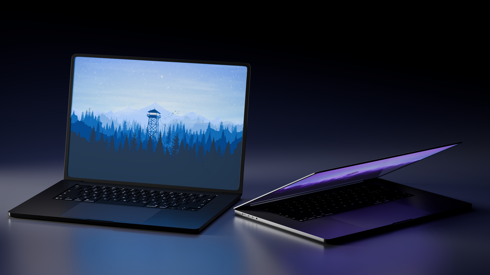

# Macbook Reveal

## Description
This image is a high-quality 3D product render featuring two modern MacBook Pros set against a dark, minimalist background. The composition creates a sense of depth and showcases the product from multiple angles.

### Technical Details

**Materials:**
*   **Anodized Aluminum:** The chassis of the laptops features a classic metallic matte finish. One laptop appears to be in "Space Black" or a very dark "Space Gray," while the other shows a lighter "Silver" edge. The material realistically catches highlights along the chamfered edges.
*   **Glass:** The screens have a glossy glass material. While they are primarily emissive (showing the wallpaper), they also show very subtle, sharp reflections of the surrounding environment.
*   **Matte Plastic/Polycarbonate:** The keyboard keys have a fine, matte texture that contrasts with the metallic body.
*   **Trackpad:** The large trackpads have a smooth, etched-glass appearance, reflecting the light differently than the surrounding metal.

**Lighting:**
*   **Rim/Accent Lighting:** Subtle blue and purple area lights are placed to the sides and behind the laptops. This creates "rim lighting" along the edges of the devices, helping them pop against the black background and defining their silhouettes.
*   **Emissive Lighting:** The primary light source for the immediate area comes from the laptop screens themselves. A soft blue glow from the left screen reflects onto its own keyboard and the surface in front of it. Similarly, the right laptop casts a purple hue.
*   **Keyboard Backlighting:** The individual keys are backlit, which is a small but essential detail for realism.
*   **Soft Shadows:** The shadows beneath the laptops are very soft and diffused, indicating the use of large area lights.

**Detail:**
*   **Accuracy:** The model includes the "notch" at the top of the display, the specific keyboard layout (including the Touch ID sensor), and the precise arrangement of ports (Thunderbolt/USB-C and MagSafe).
*   **Geometry:** The curves of the corners and the hinge mechanism are smooth and mathematically precise.
*   **Atmosphere:** The choice of a cool color palette (blues and purples) combined with the dark environment gives the image a "Pro" tech aesthetic.

